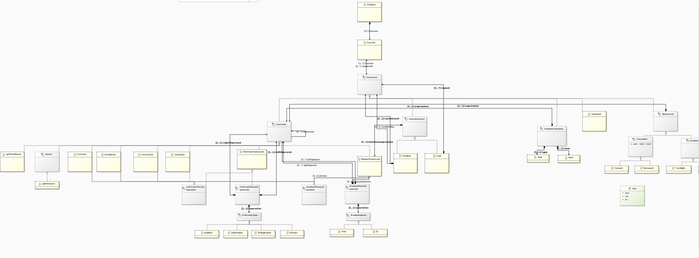

# Robot-DSL

This repository explain how to use ou Rob laguage with its extension .rob.



## Rob Language Model
This is our Ecore Model

## How to interpret

#### 1. Install dependencies
```bash
npm install
```

#### 2. Build web
```bash
npm run build:web
```

#### 3. Run server
 ```bash
 npm run serve
 ```

Then go to localhost:3000 and you can develop, validate and execute .rob code

## How to compile

#### Create .rob file
Create a .rob and fill it with the algorithm you want. You'll find examples in examples/ directory.

#### Compile
 ```bash
 node ./bin/cli compile <path_to_your_file>
 ```
This will produce a file *output.ino* file int the output/ directory

## Televerse to the robot

In order to validate the .ino file and televerse it on the robot, you have to main options :

### 1. Compile command
The compile command above will compile the .rob code into .ino and automatically try to televerse it to the robot. Make sure you're connected to the robot and just run the command

### 2. Use Arduino Client

1. Open your .ino file in the Arduino Client
2. Add all needed librairies (zips available in /src/language/compiler/lib)
3. plug the robot to your computer
4. Click *Croquis > Vérifier/Compiler*
5. Click *Croquis > Téléverser*


## Choix d'implémentation

### Grammaire

Nous avons voulu créer une grammaire avec une syntaxe plutôt simple. Le programme est composé de fonctions qui sont elles-mêmes composées de statements. Les fonctions sont déclarées en utilisant le mot-clé `def` et les variables sont déclarées en utilisant le mot-clé `var`.
Pour créer l'équivalent des boucles while en C, il faut utiliser le mot-clé `loop`. Le language Rob supporte les expressions arithmetiques et booléennes.
Pour récupérer les données des différents capteurs, voici les commandes que vous pouvez utiliser :

```javascript
var distance_value = get_distance
var speed_value = get_speed
var time = get_timestamp
```

Le point d'entrée d'un programme Rob est la fonction `entry()`.
Et voici un exemple de programme Rob qui dessine 8 octogones :

```javascript
def entry() {
    var nb_octogone = 1

    loop nb_octogone <= 8 {
        octogone()
        nb_octogone = nb_octogone + 1
    }    
}

def octogone() {
    var cote = 1

    loop cote <= 8 {
        var distance_parcourue = 0
        loop distance_parcourue < 500 {
            forward 1 m
            distance_parcourue = distance_parcourue + 1
        }
        turn_left 45
        cote = cote + 1
    }
    turn_right 45
}
```

### Interpréteur

Après avoir implémenté les fonctions `accept` du visiteur pour chaque noeud de notre AST, nous avons écrit un petit script qui interprète un programme Rob.

Le principe est simple : Langium récupère le Model correspondant au point d'entrée de notre AST, puis instancie un visiteur qui visite tous les noeuds de notre programme.


L'interpréteur s'utilise de cette façon : `node bin/cli.js interpret <script Rob>`.
Par exemple, le programme `examples/helloworld.rob` est un programme de test, il permet de print les nombres de 0 à 10.


#### Simulateur

La communication front-back pour le simulateur a été implémentée avec des web sockets : une session web socket est ouverte pour permettre la communication, puis le code est envoyé au serveur qui vérifie la syntaxe et interprète le programme. À chaque mouvement du robot, la scène entière est envoyée au client par web socket encore une fois. Cette méthode garantie une communication stable entre le serveur et le client.

Un clique sur le bouton "Parse And Validate" fera apparaitre soit un check vert soit une croix rouge suivant le résultat du parse and validate.

Un clique sur le bouton "Execute" fera bouger et tourner le robot suivant le programme écrit dans l'éditeur de code. Lorsque que le robot bouge, une ligne verte est dessinée derrière lui pour savoir quel chemin il a parcouru.


### Compilateur

Le principe du compilateur est le même qui celui de l'interpréteur : Langium récupère le Model correspondant au point d'entrée de notre AST, puis instancie un visiteur qui visite tous les noeuds du programme. En visitant les noeuds, le compilateur construit une chaîne de caractères qui constitue le programme arduino final.

Le visiteur ajoute le code compilé à une base initiale. Cette base comprend l'instance du robot, l'instance des roues, une variable globale SPEED et les fonctions bas niveau qui permettent au robot d'avancer et de tourner. 

Voici la fonction bas niveau qui fait avance le robot de x mètres :
```c
void __move_forward__(int value) {
    Omni.setCarAdvance(__SPEED__);
    Omni.delayMS(value * 1000 / __SPEED__);
}
```

et voici le code qui transforme le noeud de notre AST `go forward x m` en code arduino :
```javascript
visitGoForward(node: GoForward) {
    return "__move_forward__(" + acceptNode(node.distance, this) + ")\n";
}
```

Si l'arduino est connecté au pc par USB, la commande `node ./bin/cli compile <path_to_your_file>` compile et téleverse directement le code arduino généré. Vous pouvez donc écrire votre programme Rob et l'exécuter sur le robot en une seule commande.
